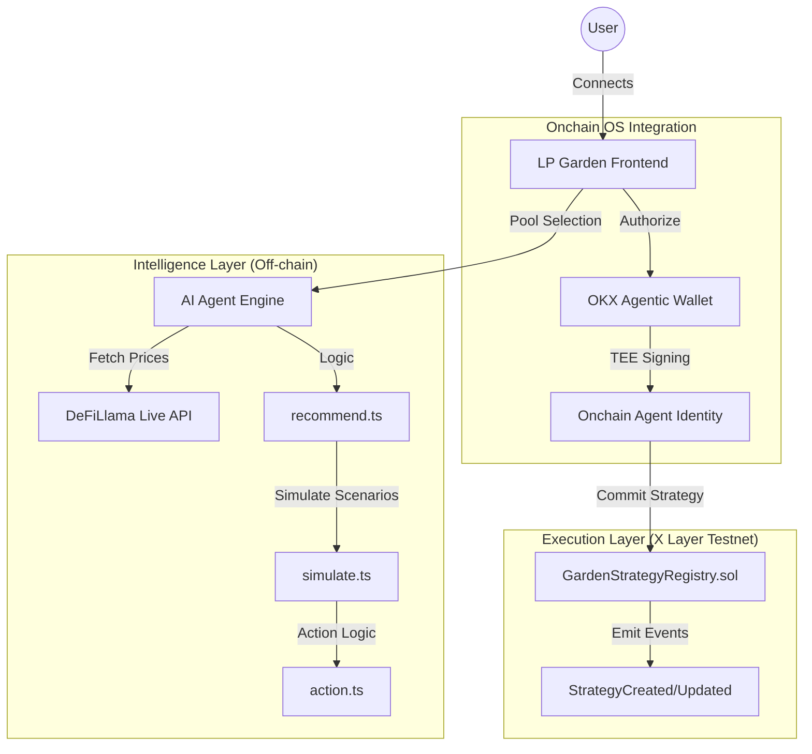

# LP Garden 🌱

## Autonomous LP Range Optimization on X Layer

> **"The intelligent liquidity coordination layer for the X Layer agentic economy."**

LP Garden is an AI-powered liquidity position (LP) range optimizer built on **X Layer**. It transforms static liquidity provision into an autonomous, agent-driven strategy by leveraging **Onchain OS Skills** and **TEE-secured Agentic Wallets**.

---

## 🏛 Architecture Overview

LP Garden operates a hybrid architecture that balances off-chain intelligence with on-chain trust:



### Key Components

- **Agent Engine**: Performs real-time volatility classification and runs 30-day IL vs. Fee simulations across three market scenarios.
- **Onchain OS Skill**: Implements a dedicated "Uniswap Liquidity Planning" skill for verifiable strategy authorization.
- **Agentic Wallet**: A TEE-protected identity that acts as the "Manager" of the user's long-term liquidity strategy.

---

## 🤖 Agentic Wallet Identity

LP Garden utilizes the **OKX Agentic Wallet** as its primary onchain identity. This ensures that every strategy commitment is backed by a verifiable, TEE-secured signing process.

- **Agent Name**: LP Garden Optimizer Agent
- **Identity Address**: `0xca897becDBd37456331abB362e7ee9F15e9F41c0` (Registry)
- **Agentic Wallet**: `0x684716496604b19f3883101e744482f43b3d76d3` (Managed via Onchain OS)
- **Security**: Private keys are generated and stored entirely within a **Trusted Execution Environment (TEE)**, meaning the AI Agent can act on behalf of the strategy logic but cannot expose or lose keys.
- **Benefits**: Zero-gas execution on X Layer and immediate anomaly detection.

---

## 🛠 Onchain OS & Uniswap Skills Usage

LP Garden is built using core modules from the **Onchain OS Skills** ecosystem to bridge the gap between AI reasoning and on-chain execution.

### `okx-agentic-wallet` Skill

We use this skill to manage the full lifecycle of the strategy agent:

- **Authentication**: Secure email-based OTP login to restore the Agent's identity.
- **Verification**: TEE-based signing (personalSign) for every strategy "snapshot" before it is committed on-chain.
- **Asset Management**: Future capability to autonomously rebalance positions based on simulation results.

### `uniswap-liquidity-planning` Core Module

LP Garden integrates a custom core module following the Uniswap AI skill structure:

- **`src/lib/agent/onchain-os.ts`**: Encapsulates the specific logic for Uniswap V3 concentrated liquidity calculation, mapping volatility (Low/Med/High/Extreme) to optimal tick ranges.

---

## ⛓️ Deployment & Working Mechanics

### Smart Contract

- **Contract Name**: `GardenStrategyRegistry.sol`
- **Address**: `0xca897becDBd37456331abB362e7ee9F15e9F41c0`
- **Network**: X Layer Testnet (Chain ID 195)
- **Verified**: Yes (Foundry Test Suite 100% Coverage)

### Working Mechanics

1. **Analysis**: The agent fetches real-time pool metrics from DeFiLlama.
2. **Simulation**: Runs 30-day Monte Carlo projections for Bull, Bear, and Crab scenarios.
3. **Recommendation**: Outputs a deterministic recommendation (Deploy, Wait, Widen, Rebalance, or Exit).
4. **Commitment**: The Agentic Wallet signs the strategy hash, and the user commits the parameters to the X Layer Registry.

---

## 🌐 Ecosystem Positioning

As AI agents become the primary actors on **X Layer**, liquidity provision must evolve beyond manual "set and forget" ranges. LP Garden positions itself as the **intelligent liquidity coordinator**. By providing a verifiable on-chain registry of "Agent-Approved" strategies, we enable other automated protocols to trust and build on top of our optimized ranges, creating a more efficient and liquid X Layer ecosystem.

---

## 👥 Team

- **Rune**: Frontend Architecture & Web3 Integration
- **Velkan**: Agent Engine & Quantitative Logic

---

## 🚀 Getting Started

```bash
# 1. Install Onchain OS Skills
npx skills add okx/onchainos-skills

# 2. Login to the Agentic Wallet
# (Run in terminal) onchainos wallet login <email>

# 3. Start optimization
npm run dev
```
